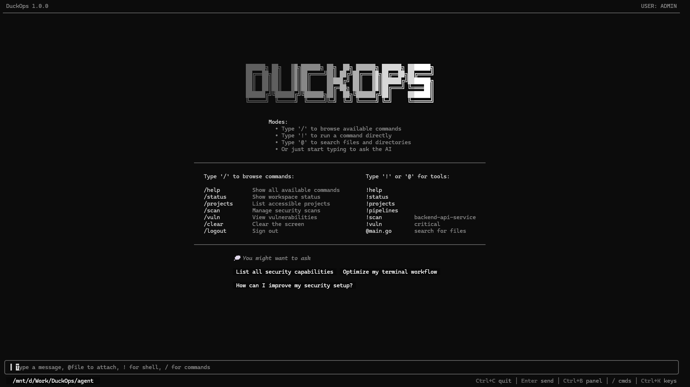

<div align="center">

# 🦆 DuckOps Agent

**The Extensible DevSecOps & Software Engineering AI Agent**

[](https://golang.org/doc/devel/release.html)
[](https://opensource.org/licenses/MIT)

*An advanced, extensible AI agent framework designed to orchestrate DevSecOps workflows securely from your terminal.*
</div>

---

## 📖 Overview

**DuckOps** is a powerful AI agent tailored for engineering and security tasks. It brings the power of frontier Large Language Models (LLMs) directly into your workflow, combining conversational interaction with robust, sandboxed command execution. 

Unlike simple chat wrappers, DuckOps is built on an enterprise-grade foundation featuring the **Warden sandbox** (with AWS Cedar policies), full **Model Context Protocol (MCP)** integration, robust **Hooks**, and comprehensive **Audit Logging**.

## ✨ Key Features

- **🛡️ Warden Sandbox & Cedar Policies**: Restrict what the agent can do using AWS Cedar policy files (e.g., `deny_execution.cedar`). Protect your host by controlling volume mounts, proxying network access, and actively gating dangerous commands.
- **🔌 Model Context Protocol (MCP) Integration**: Seamlessly connect external MCP servers (via `stdio` or `sse`) to give the agent new capabilities like GitHub access, Postgres querying, or running external security scanners.
- **🪝 Extensible Hook System**: Intercept and modify agent behavior using shell scripts. Create hooks for `BeforeTool`, `AfterTool`, `BeforeScan`, or `SessionStart` to enforce security gates or trigger Slack notifications.
- **🤖 Rich Tool Ecosystem**: Ships with built-in tools for:
  - `shell` / `terminal`: Execute bash commands and interact with REPLs locally or securely.
  - `file_ops` / `search`: Read, edit, and grep your local workspace.
  - `subagent` / `delegate`: Spawn background sub-agents for complex task breakdown.
  - `web_search` / `web_fetch`: Real-time internet access for documentation and debugging.
- **🔒 Enterprise Governance**: Features built-in Secrets Substitution (preventing API keys from leaking to LLMs) and comprehensive Audit logging with optional remote SSH backups.
- **🌐 Provider Agnostic**: Bring your own models. Natively supports OpenAI, OpenRouter, and more via a flexible `config.toml`.

## 🚀 Quick Start

### Prerequisites
- Go 1.24+

### Installation

Clone and build the binary:

```bash
git clone https://github.com/SecDuckOps/agent.git
cd agent
go build -o duckops ./cmd/duckops/...
```

### Usage Modes

DuckOps adapts to your preferred way of working:

```bash
# 1. TUI Mode (Default)
# Launches the rich interactive Terminal User Interface
duckops

# 2. Conversational Scan Mode
# Focused agent specifically tuned for scanning workflows
duckops --scan

# 3. Server Mode
# Runs a background HTTP server for external interactions
duckops serve

# 4. Legacy LLM REPL
duckops --cli
```

## ⚙️ Configuration

DuckOps is highly configurable. On first run, it initializes `~/.duckops/config.toml` and default policy files.

Here is an example configuration showcasing its power:

```toml
version = 1

[profile.default]
provider = "openrouter"
model    = "openrouter/arcee-ai/trinity-large-preview:free"

[profile.default.providers.openrouter]
type = "custom"
base_url = "https://openrouter.ai/api/v1"
auth.type = "env"
auth.key = "OPENROUTER_API_KEY"

[profile.default.warden]
enabled = true
default_deny = true
volumes = ["./:/agent:ro"]
policy_files = ["~/.duckops/policies/deny_execution.cedar"]

[hooks]
dir = "~/.duckops/hooks"

[[hooks.BeforeTool]]
name    = "block-dangerous"
matcher = "shell|terminal"
command = "~/.duckops/hooks/security-gate.sh"

[[mcp.servers]]
name = "github-mcp"
transport = "stdio"
command = ["npx", "-y", "@modelcontextprotocol/server-github"]
enabled = true
```

## 🧠 Under the Hood

DuckOps architecture revolves around strict separation of concerns:
- **Agents & Subagents**: The reasoning engine capable of delegating to specialized workers.
- **Tools**: The hands of the agent (shell, file_ops, web_fetch, MCP).
- **Warden**: The protective layer intercepting system calls and validating them against Cedar policies.
- **State App/Checkpointing**: Saves conversational checkpoints to a local SQLite database (`~/.duckops/data/local.db`) allowing you to resume (`--resume`) sessions anytime limitlessly.

## 💻 Commands

DuckOps binaries expose the following core CLI commands:
- `duckops run` - Start interactive mode without the background server.
- `duckops serve` - Boot the background agent server.
- `duckops login` - Authenticate against the DuckOps API gateway.
- `duckops config` - Manage the agent configuration interactively.
- `duckops log` - View recent audit and execution logs.

## 🤝 Contributing

Contributions are welcome! 

1. Fork the Project
2. Create your Feature Branch
3. Commit your Changes
4. Push to the Branch
5. Open a Pull Request

## 📄 License

Distributed under the MIT License. See `LICENSE` for more information.

---

<div align="center">
  <i>Built with ❤️ to safeguard operations.</i>
</div>
